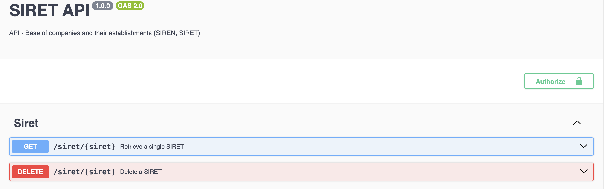

# Project Report - Application of Big Data

– What it is?
– What it does?
– How does it install and work?


## Introduction

This report describes the IT project carried out by ARBEY Louis, BILLAUDEAU Thomas et CRETINON Pierre-Louis as part of the "Application of big data" course. The aim of the project was to create an API for accessing a database in real time.


## Steps of the project

In order to realize this project, we followed some steps that we will describe now. For the different technologies that we have used, we will see them in a following part. 
- Get the dataset (from teams)
- Insert it into a database (PostgreSQL)
- Create an API able to get, modify or delete a siret number
- Create a file with logs


## Technologies we have used

In order to answer the best to the project instructions, we decided to use several technologies, for the coding part, but also the organisational one. We will list the different technologies bellow and argue why we chose it : 

The first step was to insert the dataset in the postresql database. [why postgre ?]Because the dataset was very heavy, we used the cmd in order toload our dataset. We used this [cmd line]. 

We decided to use Visual Studio Code for the coding part of the project.  
[Explain connexion]  
Then, thanks to Visual Studio Code, we were able to generate some documentation for the javascript functiuns with the extensions of the software.  

We worked with node.js because we are used to work with it. 

[Explain Swagger]

We also worked with Github, which allowed us to code together, and share our work.  

Finally, we organised our files into folders in order to make our code more understandable and easy to use. 

// Maybe j'en oublie donc je laisse au cas ou t'as capté
- Nodejs
- Postgresql
- VsCode -> extensions pour générer js doc pour fonctions javascript
- Organisation en fichiers
- Github
- Swagger


## Documentation

Swagger interface for documentation


Example of response when trying requests


## Load the data into the Database

```bash
COPY dataset_first_version FROM [CSV File Url] WITH (FORMAT csv, HEADER);
```